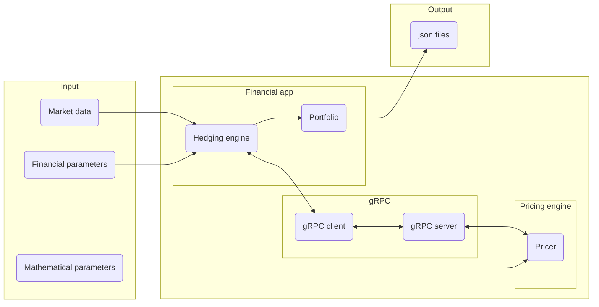

# Projet de couverture de produits multi-flux

## Présentation

L'objectif de ce projet est d'implémenter une application permettant de couvrir des produits dérivés dans un cadre plus général que celui du Projet de Couverture de Produits Dérivés: l'application développée permettra de couvrir des produits dérivés basés sur un calendrier réel, et versant plusieurs flux.

La réalisation de ce projet permettra à chaque élève:

- De comprendre de quelle façon peut être couvert un produit dérivé multiflux.
- D'implémenter de bout en bout une application composée de deux parties:
  - Une application *financière* à laquelle sont fournies les données financières, qui gère les dates de constatation et constitue le portefeuille de couverture. Cette application prendra 3 arguments dans cet ordre
    1. le fichier de description des paramètres financiers (`financial-param.json`)
    2. le fichier de données de marché (`MarketData.csv`)
    3. le fichier contenant le portefeuille de couverture en sortie (`portfolio.json`)
  - Une application *mathématique*  dont le rôle est de calculer les quantités de sous-jacent à détenir dans le portefeuille de couverture. Cette application prendra comme unique argument le fichier des paramètres mathématiques (`math-param.json`) que l'on supposera cohérent avec son équivalent financier `financial-param.json`.

## Payoff

 On considère un entier $`n\in \mathbb{N}`$ et on pose

 ```math
 \begin{align*}
 S &= (S_1, \ldots, S_n)\\
\mathcal{T} &= (t_1,\ldots, t_n)\\
\mathcal{K} &= (K_1,\ldots, K_n)\\
C_0 & = \Omega\\
C_i & = C_{i-1} \cap \left\{S_i(t_i) \leq K_i\right\}\\
P_i & = \left(S_i(t_i) - K_i\right)_+\cdot\mathbb{1}_{C_{i-1}}
 \end{align*}
 ```

 Le produit dérivé verse le flux
 $`P = \sum_{i=1}^n P_i`$, autrement dit, il verse le flux $`P_i`$ à la date $`t_i`$.

## Organisation, contraintes techniques

- L'application financière devra être codée en C# (.NET 6). Il s'agira d'une application console qui prend en entrée une configuration de produit et des données de marché, et fournit en sortie un fichier json qui contient les résultats.
- Le coeur de calcul devra être codé en C++.
- La communication entre l'application financière et le coeur de calcul se fera à l'aide d'un client et d'un serveur gRPC.


